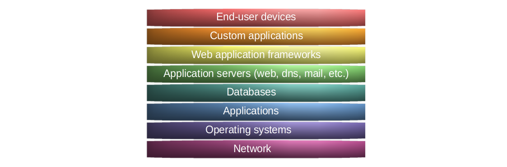

Threat models
=================================================

Some starting points for the blue team in a digital landscape formed by nature's own processes and humanoid activities
throughout decades.

.. toctree::
   :caption: End-points

   macOS <https://tymyrddin.github.io/macos-mitigations/>
   Windows PC <https://tymyrddin.github.io/windows-pc-mitigations/>
   Linux PC <https://tymyrddin.github.io/linux-pc-mitigations/>
   Android <https://tymyrddin.github.io/android-mitigations/>
   iOS <https://tymyrddin.github.io/ios-mitigations/>
   Personal data <https://tymyrddin.github.io/data-mitigations/>
   Linux server <https://tymyrddin.github.io/linux-server-mitigations/>

.. toctree::
   :caption: Network

   Network <https://tymyrddin.github.io/network-mitigations/>

.. toctree::
   :caption: Internet applications

   Webserver <https://tymyrddin.github.io/webserver-mitigations/>
   Mailserver <https://tymyrddin.github.io/mailserver-mitigations/>

.. toctree::
   :caption: Software development

   Web applications <https://tymyrddin.github.io/app-mitigations/>

.. toctree::
   :glob:
   :maxdepth: 1
   :includehidden:
   :caption: Threat intelligence

   docs/context/*

.. toctree::
   :caption: Links

   Attack trees <https://tymyrddin.github.io/attack-trees/>
   Threat models <https://tymyrddin.github.io/threat-models/>