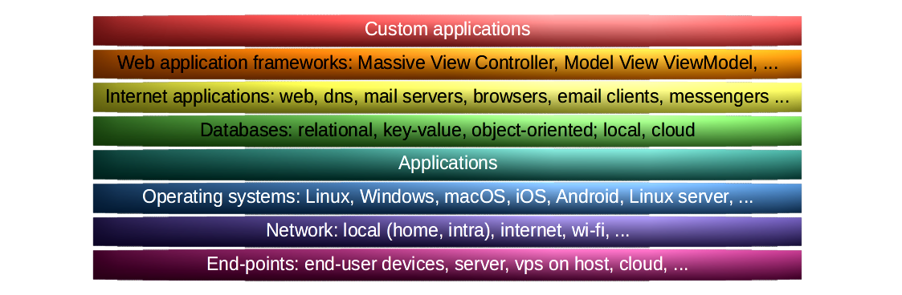

Blue Team
=================================================

The blue team is a group focused on protecting assets. This includes monitoring the security
controls, the intrusion detection systems, the logs to protect the assets and identify when a security breach
occurs, and raising security awareness overall (ie make the writeups human-readable for intended audiences).
These are some writeups made on our journeys in a digital landscape formed by nature's own
processes and humanoid activities and neglect throughout decades.

.. toctree::
   :caption: Forest writeups

   macOS <https://tymyrddin.github.io/macos-mitigations/>
   Windows PC <https://tymyrddin.github.io/windows-pc-mitigations/>
   Linux PC <https://tymyrddin.github.io/linux-pc-mitigations/>
   Android <https://tymyrddin.github.io/blue-android/>
   iOS <https://tymyrddin.github.io/blue-ios/>
   Personal data <https://tymyrddin.github.io/data-mitigations/>
   Linux server <https://tymyrddin.github.io/linux-server-mitigations/>
   Network <https://tymyrddin.github.io/network-mitigations/>
   Webserver <https://tymyrddin.github.io/webserver-mitigations/>
   Mailserver <https://tymyrddin.github.io/mailserver-mitigations/>
   Web applications <https://tymyrddin.github.io/app-mitigations/>

.. toctree::
   :caption: Links

   Red Team <https://tymyrddin.github.io/red/>
   Green Team <https://tymyrddin.github.io/threat-models/>