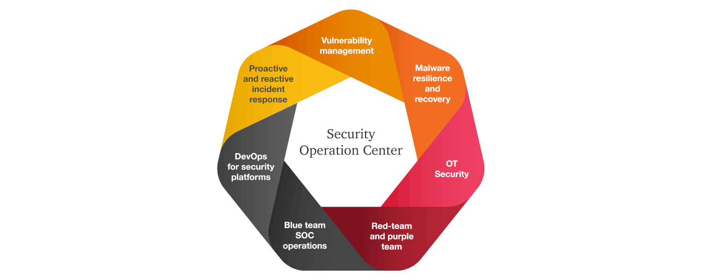

Blue Team
=================================================

The blue team is a group focused on protecting assets. This includes monitoring the security
controls, the intrusion detection systems, the logs to protect the assets and identify when a security breach
occurs, and raising security awareness overall (ie make the writeups human-readable for intended audiences).

These are some writeups made on our journeys in a digital landscape formed by nature's own
processes and humanoid activities and neglect throughout decades. Expect some tongue-in-cheek.

----

.. toctree::
   :caption: Security operations

   Threat intelligence <https://tymyrddin.github.io/blue-intel/>
   Threat and vulnerability management <https://tymyrddin.github.io/blue-threats/>
   Network traffic analysis (NTA) <https://tymyrddin.github.io/blue-nta/>
   Endpoint detection and response (EDR) <https://tymyrddin.github.io/blue-edr/>
   Security information and event management (SIEM) <https://tymyrddin.github.io/blue-siem>
   Digital forensics and incident response (DFIR) <https://tymyrddin.github.io/blue-dfir/>
   Phishing analysis and prevention <https://tymyrddin.github.io/blue-phish/>
   Malware analysis <https://tymyrddin.github.io/blue-malware/>

----

.. toctree::
   :caption: Security operations development

   Shift left web devsecops applications <https://tymyrddin.github.io/blue-app/>
   Documentation <https://tymyrddin.github.io/documentation/>
   Development security operations (DevSecOps) <https://tymyrddin.github.io/blue-devsecops/>
   Smarter mail servers <https://tymyrddin.github.io/blue-mailserver/>
   Deception technology <https://tymyrddin.github.io/blue-honey/>
   Recent threats <https://tymyrddin.github.io/blue-recent/>

----

.. toctree::
   :caption: Endpoint mitigations

   Hardening macOS <https://tymyrddin.github.io/blue-macos/>
   Hardening Windows <https://tymyrddin.github.io/blue-windows/>
   Hardening GNU/Linux <https://tymyrddin.github.io/blue-linux/>
   Android hardening <https://tymyrddin.github.io/blue-android/>
   iOS hardening <https://tymyrddin.github.io/blue-ios/>
   Protecting personal data <https://tymyrddin.github.io/blue-pdata/>
   Hardening Linux server <https://tymyrddin.github.io/blue-server/>
   Network mitigations <https://tymyrddin.github.io/blue-network/>
   Hardening webserver <https://tymyrddin.github.io/blue-webserver/>

.. image:: _static/images/vulnerability-stack.png
  :alt: Vulnerability stack

----

.. toctree::
   :caption: Links

   Curated collections of sessions on youtube <https://www.youtube.com/@ninabarzh/playlists>
   Laws of the forest <https://tymyrddin.github.io/>
   Red Team <https://tymyrddin.github.io/red/>
   Green Team <https://tymyrddin.github.io/green/>
